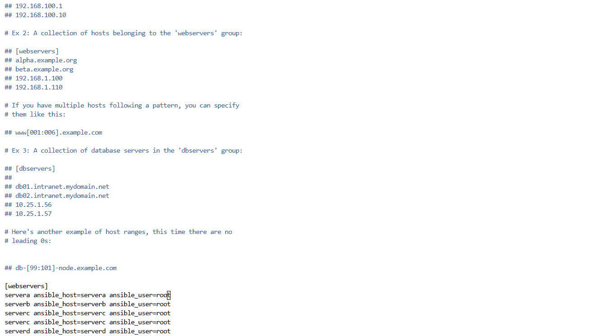
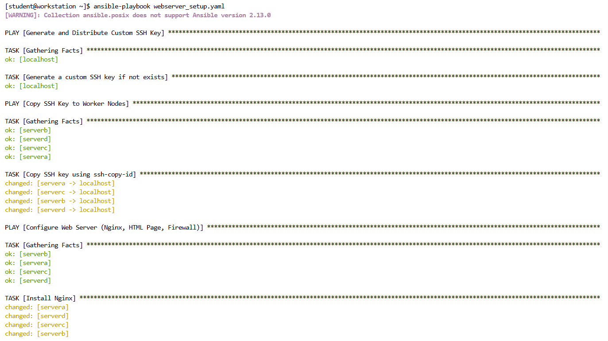
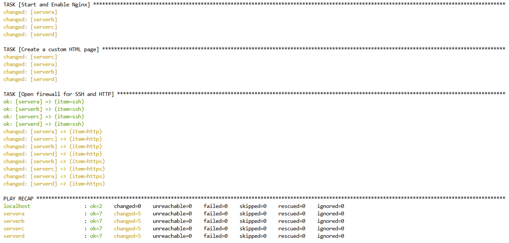
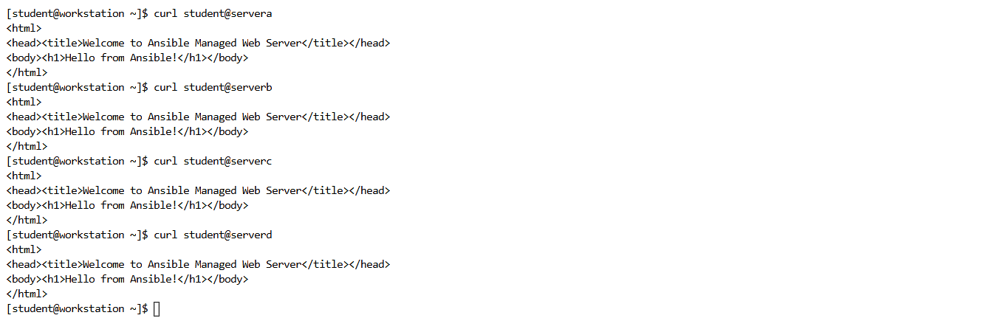

# Ansible Playbook for Web Server Setup

## Overview
This guide outlines the steps to automate SSH key distribution, install and configure a web server using Ansible, and set up firewall rules. The playbook ensures secure SSH access and deploys an Nginx web server with a custom HTML page.

## Steps Performed

### 1. Configure Ansible Inventory
- Open the Ansible inventory file:
  ```bash
  vim /etc/ansible/hosts
  ```
- Added a new group `webservers` and defined the managed hosts.

### 2. Generate and Distribute SSH Keys
To enable passwordless SSH authentication:
- An SSH key is generated on the control node if it does not already exist.
- The key is then copied to all worker nodes for seamless Ansible communication.

### 3. Deploy Web Server and Firewall Configuration
The Ansible playbook performs the following tasks:
- Installs Nginx on web servers.
- Starts and enables the Nginx service.
- Deploys a custom HTML page.
- Configures the firewall to allow SSH, HTTP, and HTTPS traffic.

## Verification
To ensure the setup was successful:
- Check if Nginx is running:
  ```bash
  systemctl status nginx
  ```
- Access the web page by navigating to `http://<worker-node-ip>`.
- Confirm firewall rules:
  ```bash
  firewall-cmd --list-all
  ```

## Screenshots
### 1. Editing Ansible Inventory


### 2. PlayBook Running




### 3. Web Server Deployment



## Conclusion
Ansible has been successfully configured to:
- Enable passwordless SSH access.
- Install and configure an Nginx web server.
- Deploy a custom web page.
- Set up firewall rules for secure access.

This setup allows for automated web server deployment and management across multiple worker nodes using Ansible.

