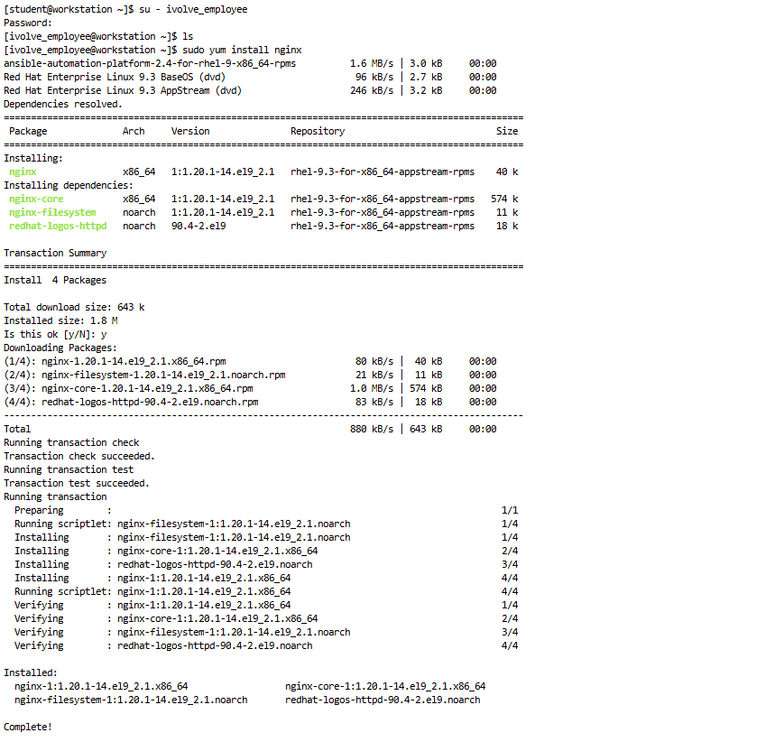

# Create User and Install Nginx with Sudo Privileges

## Overview
This script automates the process of creating a new user and group, configuring sudo permissions, and allowing the user to install Nginx without a password prompt.

## Features
- Creates a new group `ivolve`.
- Creates a new user `ivolve_employee` and assigns it to the `ivolve` group.
- Grants the user sudo permissions to install Nginx without requiring a password.
- Installs Nginx using the new user.

## Prerequisites
- A Linux system (Tested on RHEL 9.3)
- Sudo privileges

## Script Usage
1. **Make the script executable:**
   ```bash
   chmod +x createUser.sh
   ```

2. **Run the script as a superuser:**
   ```bash
   sudo ./createUser.sh
   ```

## Verification Steps
After executing the script, follow these steps to verify:

### 1. Check if the group `ivolve` exists
```bash
getent group ivolve
```
Expected Output:
```
ivolve:x:1003:
```

### 2. Check if the user `ivolve_employee` exists
```bash
id ivolve_employee
```
Expected Output:
```
uid=1003(ivolve_employee) gid=1003(ivolve) groups=1003(ivolve)
```

### 3. Switch to the new user and install Nginx
```bash
su - ivolve_employee
sudo yum install nginx
```
Expected Output:
- The installation should proceed **without prompting for a password**.

## Screenshots
Here are the screenshots demonstrating the execution:
1. **Script Execution** 
2. **Group Verification** 
3. **User Verification**  
4. **Nginx Installation with Sudo** 