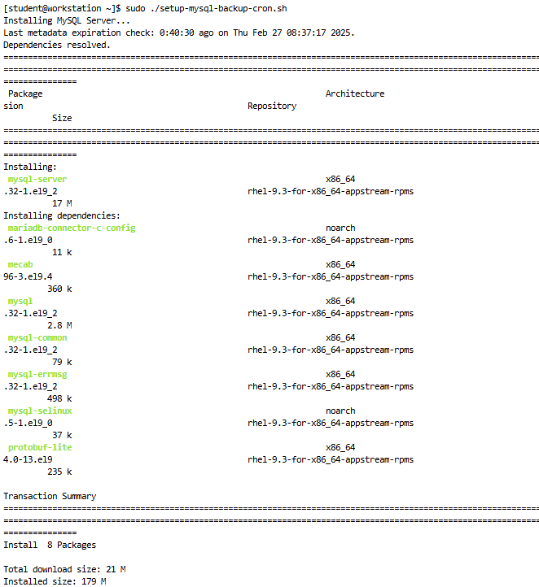
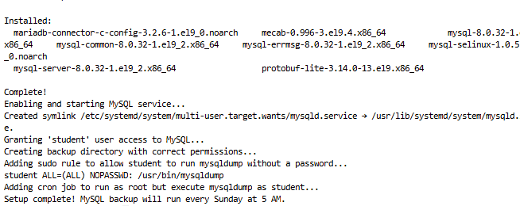
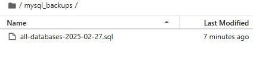

# MySQL Backup Cron job Setup

## Overview
This setup script installs MySQL, configures user permissions, and sets up a cron job to take automatic backups of all databases every Sunday at 5 AM.

## What This Script Does
✅ Installs MySQL
✅ Starts MySQL and enables it on boot
✅ Adds `student` to the MySQL group
✅ Creates `/home/student/mysql_backups` with proper ownership
✅ Adds a sudo rule so `student` can run `mysqldump` without a password
✅ Adds a cron job under `root`, but `mysqldump` runs as `student`

## Usage
Run the following command to execute the setup script:

```bash
sudo ./setup-mysql-backup.sh
```

## Verification
After running the script, confirm the backup by checking the `/home/student/mysql_backups/` directory:

```bash
ls -l /home/student/mysql_backups/
```

If successful, you should see backup files named in the format:

```
all-databases-YYYY-MM-DD.sql
```

## Screenshots
### 1. MySQL Installation


### 2. Setup Completion Output


### 3. Backup File Created


## Conclusion
The setup is now complete. The cron job will automatically run every Sunday at 5 AM, ensuring regular MySQL backups. If you need to restore a backup, use:

```bash
sudo mysql < /home/student/mysql_backups/all-databases-YYYY-MM-DD.sql
```

