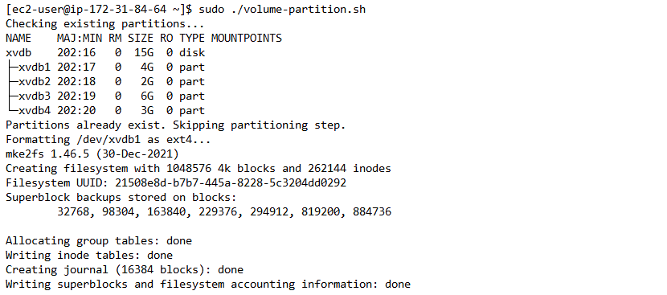
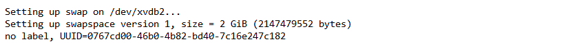
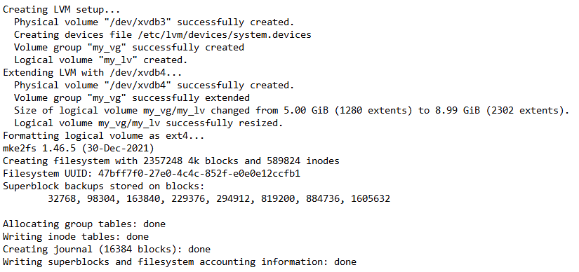
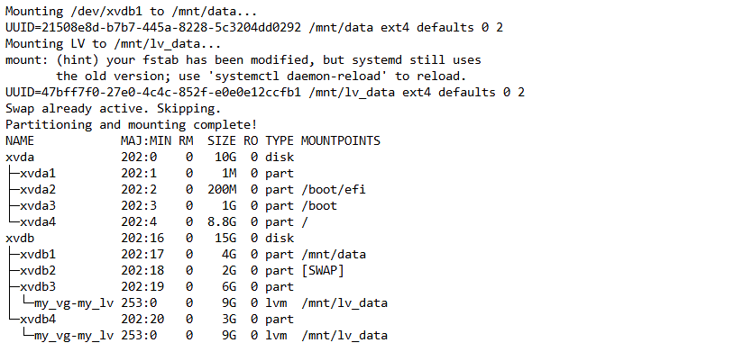
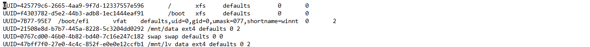

# Partitioning and Mounting Script

## Overview
This setup script partitions a disk, formats the partitions, configures swap space, and sets up logical volume management (LVM) for additional storage. It also ensures partitions exist before proceeding and checks if they are already mounted to avoid redundant operations.

## What This Script Does
- Partitions the disk into 4 partitions.
- Formats `/dev/xvdb1` as an ext4 filesystem and mounts it to `/mnt/data`.
- Sets up swap space on `/dev/xvdb2`.
- Configures Logical Volume Management (LVM) on `/dev/xvdb3` and extends it with `/dev/xvdb4`.
- Formats the logical volume and mounts it to `/mnt/lv_data`.
- Updates `/etc/fstab` to persist mounts across reboots.
- Ensures each step is performed only if necessary, avoiding reformatting or remounting existing configurations.

## Prerequisites
- A Linux system (Tested on AWS EC2 instances with Amazon Linux 2)
- A user with sudo priviliges
- A secondary disk (`/dev/xvdb`) with at least 15GB available

## Script Usage
1. **Make the script executable:**
   ```bash
   chmod +x ./volume-partition.sh
   ```

2. **Run the script as a superuser:**
   ```bash
   sudo ./volume-partition.sh
   ```

## Verification
After running the script, confirm the partitions and mounts using:

```bash
lsblk
```

You should see output similar to:
```
xvdb    202:16   0   15G  0 disk
├─xvdb1 202:17   0    4G  0 part /mnt/data
├─xvdb2 202:18   0    2G  0 part [SWAP]
├─xvdb3 202:19   0    6G  0 part
│ └─my_vg-my_lv 253:0    0    9G  0 lvm  /mnt/lv_data
├─xvdb4 202:20   0    3G  0 part
│ └─my_vg-my_lv 253:0    0    9G  0 lvm  /mnt/lv_data
```

To verify swap activation:
```bash
swapon --show
```

To check if the filesystem entries were added to `/etc/fstab`:
```bash
cat /etc/fstab
```

You should see lines like:
```
UUID=21508e8d-b7b7-445a-8228-5c3204dd0292 /mnt/data ext4 defaults 0 2
UUID=47bff7f0-27e0-4c4c-852f-e0e012ccfb1 /mnt/lv_data ext4 defaults 0 2
UUID=0767cd00-46b0-4b82-bd40-7c16e247c182 swap swap defaults 0 0
```

## Screenshots
### 1. Checking Existing Partitions


### 2. Formatting and Swap Setup


### 3. LVM Setup


### 4. Mounting


### 4. Final Verification


## Conclusion
The setup is now complete. The partitions, swap space, and logical volumes are correctly configured and persist across reboots. If any issues arise, check `/var/log/syslog` or `dmesg` for troubleshooting.

