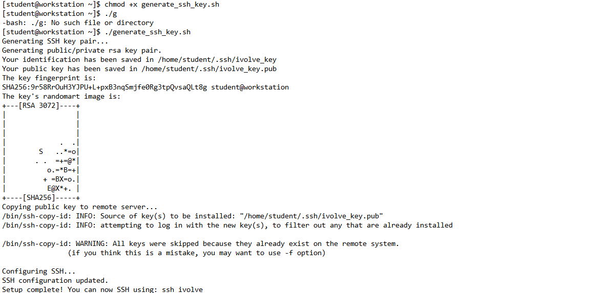

# SSH Key-Based Authentication Setup

## Overview
This setup script automates SSH key-based authentication by generating an SSH key pair, copying the public key to the remote server, and configuring SSH settings for passwordless login. Additionally, it sets up an SSH alias for easy access.

## What This Script Does
- Generates an SSH key pair.
- Copies the public key to the remote server.
- Configures SSH settings to allow passwordless login.
- Sets up an SSH alias for easy access.

## Prerequisites    
- A Linux system (Tested on RHEL 9)
- SSH access to a remote server

## Script Usage
1. **Make the script executable:**
   ```bash
   chmod +x generate_ssh_key.sh
   ```

2. **Run the script as a superuser:**
   ```bash
   sudo ./generate_ssh_key.sh
   ```

## Verification
After running the script, test the SSH connection:
```bash
ssh ivolve
```
If successful, you will be logged into the remote server without needing to specify any details.

## Screenshots
### 1. Configuring SSH Key Pair


### 2. Testing SSH Connection


## Conclusion
This setup simplifies SSH access by enabling key-based authentication and configuring an alias. You can now securely connect to your remote server with a single command: `ssh ivolve`.

